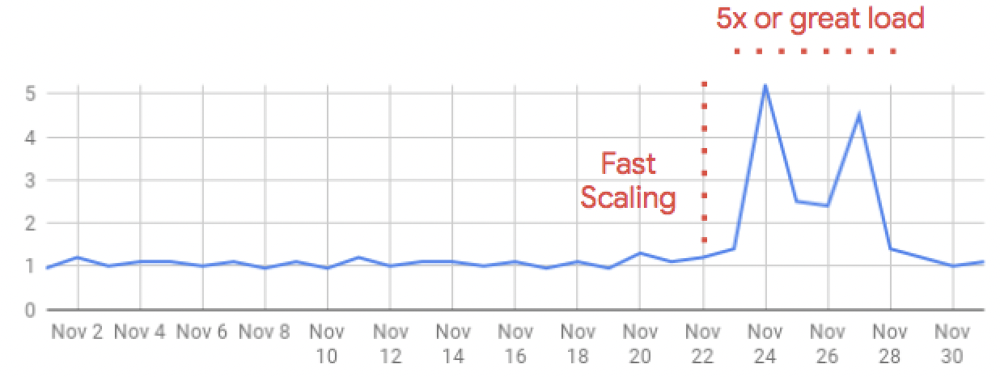
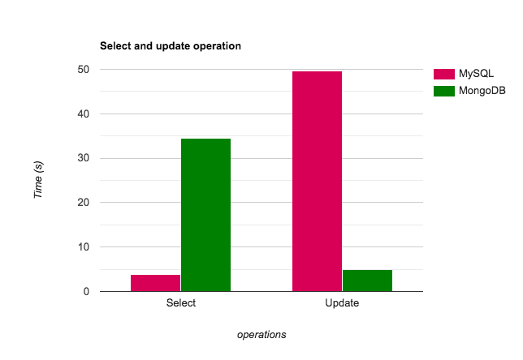
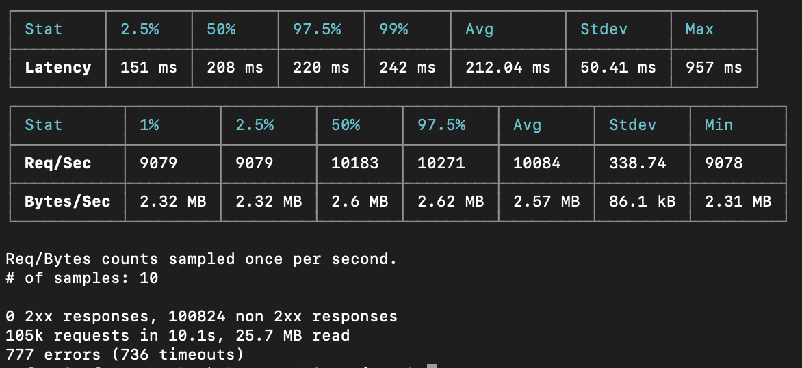
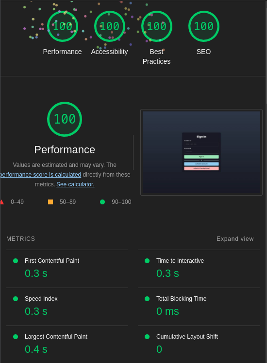

# Student Advising Portal

- CSE412 (Software Engineering) Mini Project

### Check out the Preview on - [advising-portal.vercel.app](https://advising-portal.vercel.app)

### Build with -

- [Next.js](https://nextjs.org/)
- [React.js](https://reactjs.org/)
- [MongoDB](https://www.mongodb.com/)
- [Chakra UI](https://chakra-ui.com/)

### Why serverless

### Why use MongoDB

### Stress test

### Our lighthouse performance scores

